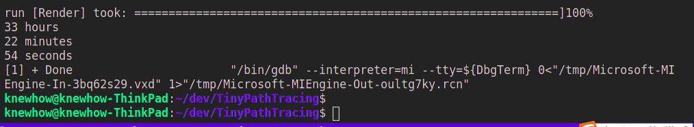

# PathTracing
A Tiny Path Tracing, refer: [Ray Tracing in One Weekend](https://raytracing.github.io/books/RayTracingInOneWeekend.html)

the result is:

in my computer 4 core 2.2GHZ, took time is: 

